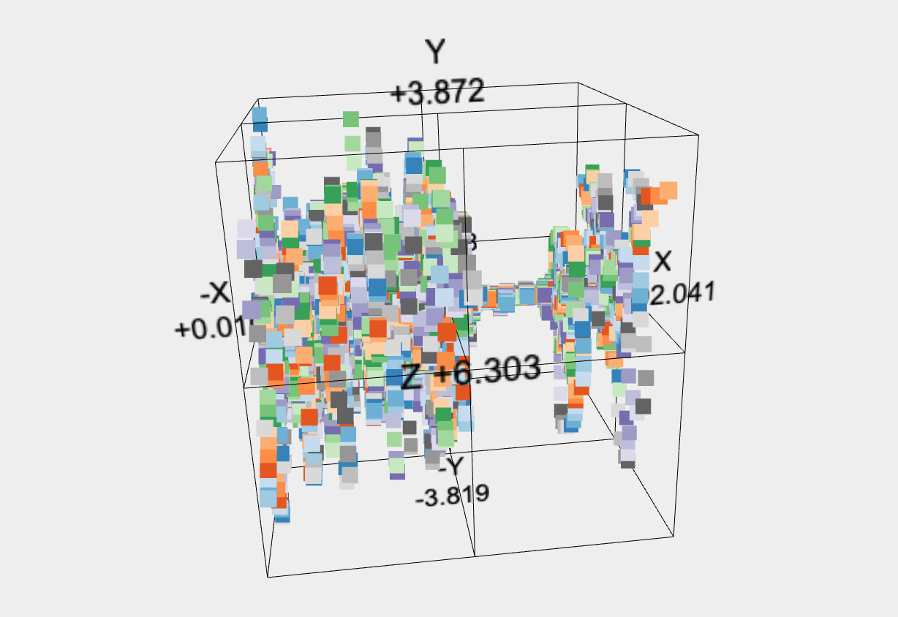
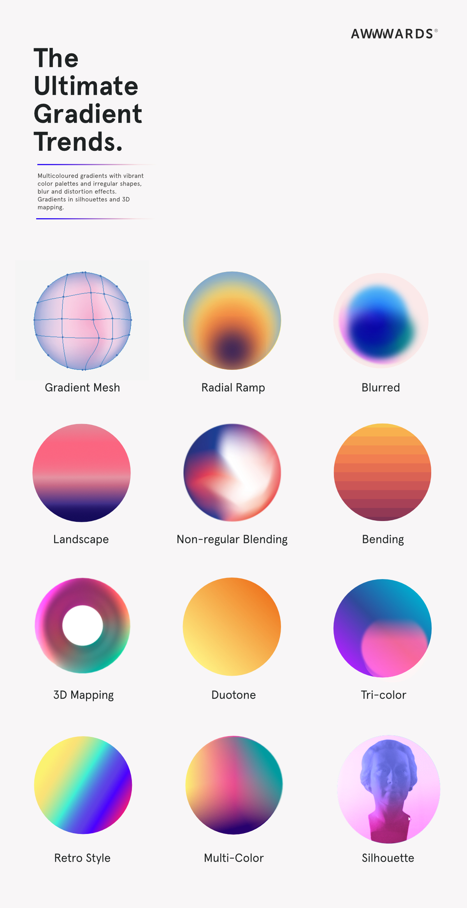
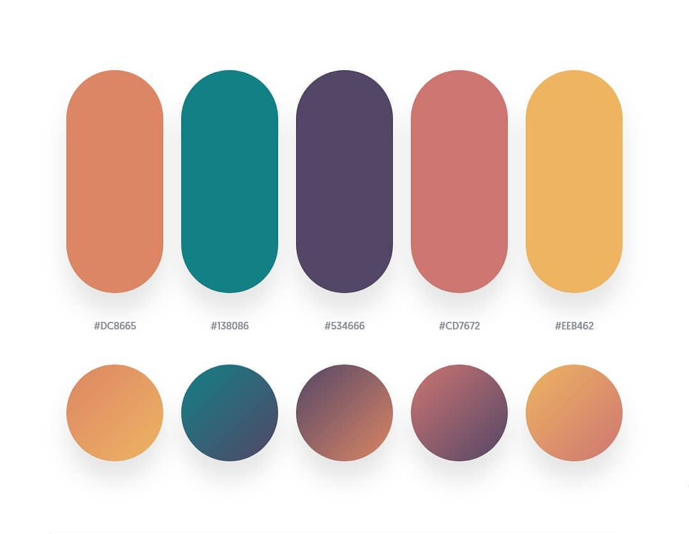
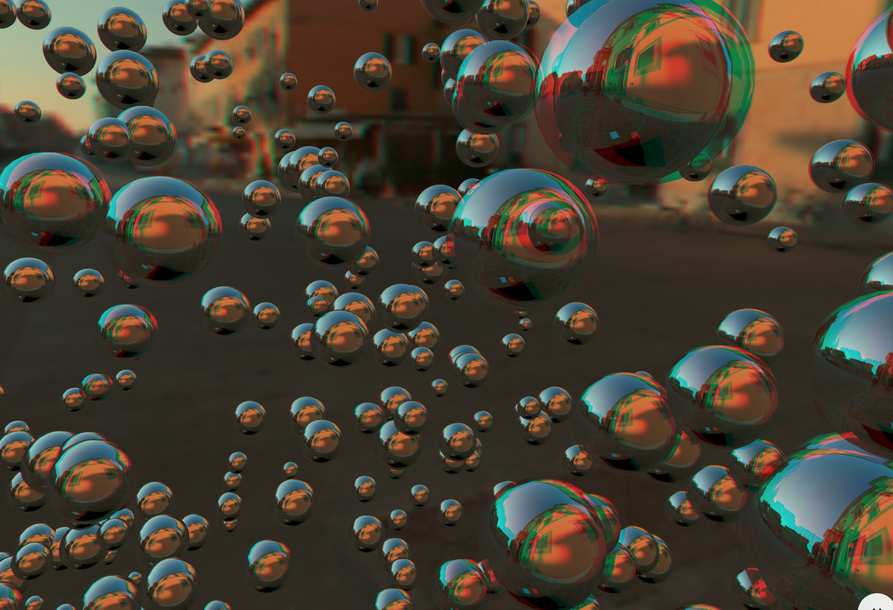
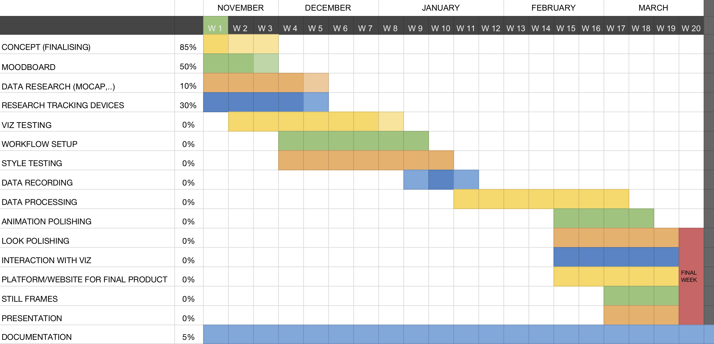
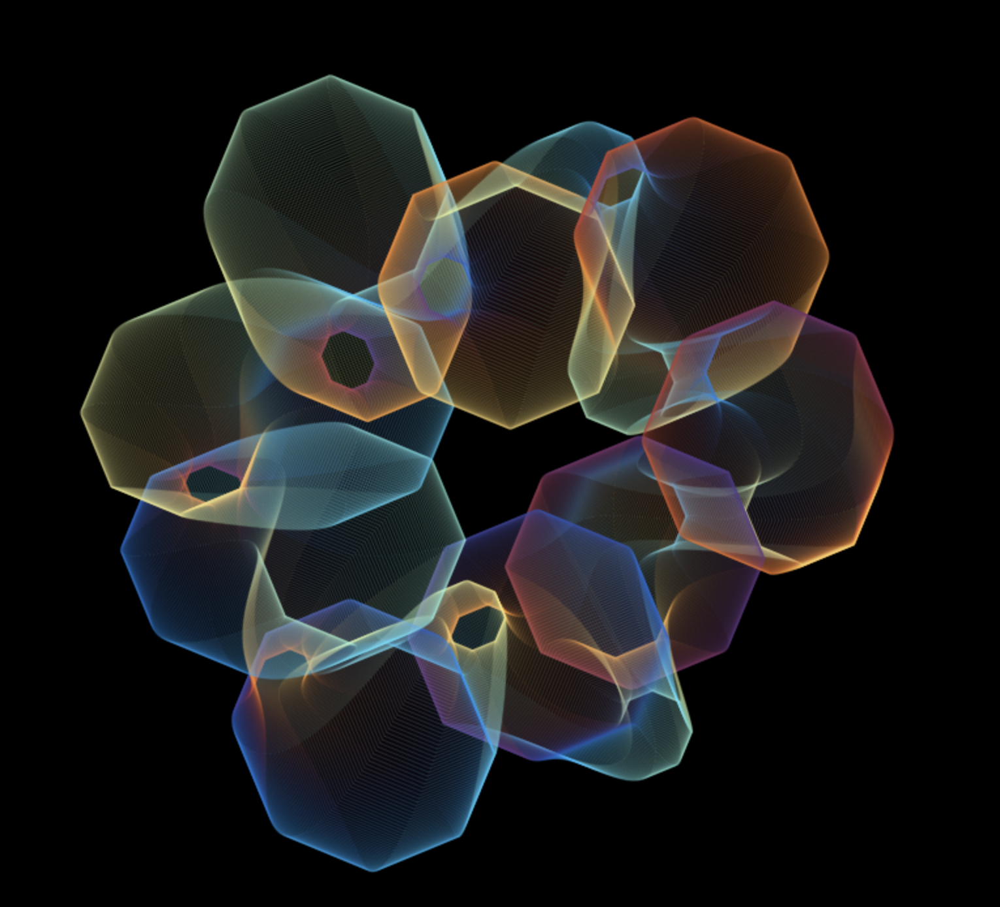
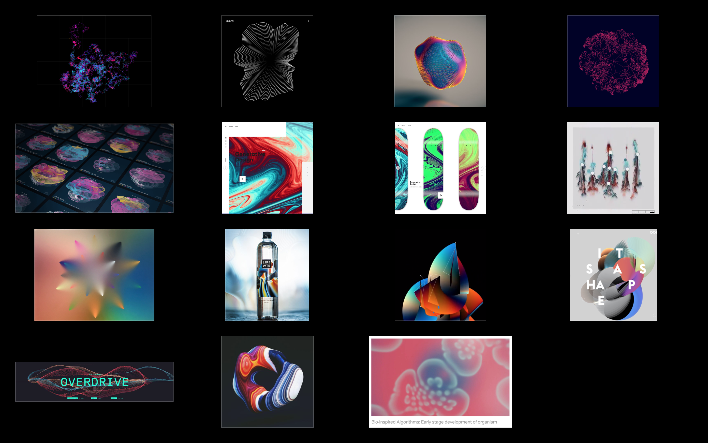
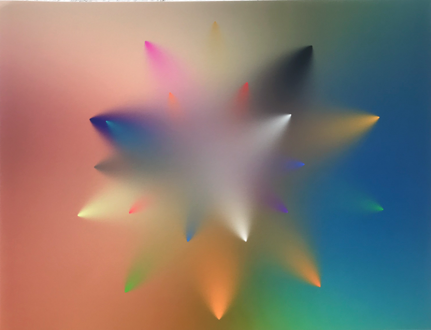

#### Next Steps

- [x]  functionality before further style (several data files, animation, zooming into data)
- [ ]  add animation (influenced by sound?)
- [x]  look further into plotter file (d3, [scatterplot](https://rdrr.io/cran/threejs/man/scatterplot3js.html),..)
- [x]  try out different inputs/interpretations of data 
- [x]  try out more 3D-ish style
- [ ]  how to switch between sports (via GUI?)
- [ ]  still images/ porttraits and viz
- [x]  website
- [ ]  create narrative/connection for sports to viz

------
### 28.03.20 (2h)
- light/environment adjustments
- add shadow to plane
- points color (defaut white for all points)
- idea: morphing 3d sports objects to acceleration data [tutorial](https://dev.to/maniflames/pointcloud-effect-in-three-js-3eic)
- exchanged orbit controls (zoom function)
- bit of clean up


### 26.03.20 (2h)
- star shaped meshline
 


### 25.03.20 (1h)
- more visual testing
 


### 17.03.20 (2h)
- should try out: use MeshLambertMaterial, set envMaps to reflective 
- can I use buffer geometry?
- half bals with [phiStart](https://threejs.org/docs/#api/en/geometries/SphereGeometry) etc.. 
- some shape tests with material, noise, color, amount of points:

 
 

### 16.03.20 (2h)
- editing some photos
- transfering and sorting recorded data 

### 15.03.20 (2h)
- recorded skating with roman
- editing some photos

 

### 12/13/14.03.20 (4h)
- added line animation
- point cloud explosion (animation)
- general animation testing


- should add:
    - sound design (bouldering: hands smearing & clap, swimming: splash, cycling: kette, bremsen, skating: street pop sound, ice skating: ice)
    - spherenoise 3d object back into scene for more 3dish style
    - color code (bouldering: white chalk point cloud, swimming: blue water splash particles)
    


### 10.03.20 (2,5h)
- mores research on animation with KeyFrames & Quaternion & AnimationClip
  - https://threejs.org/examples/?q=misc#misc_animation_keys
  - https://stackoverflow.com/questions/40434314/threejs-animationclip-example-needed
  - [parsing-and-updating-object-position-for-animation-in-three-js](https://stackoverflow.com/questions/45723324/parsing-and-updating-object-position-for-animation-in-three-js)
  - https://threejs.org/docs/index.html#api/en/math/Quaternion
  - https://threejs.org/docs/index.html#api/en/animation/AnimationClip
  - https://threejs.org/examples/jsm/animation/AnimationClipCreator.js
  - [Line Animations](http://jsfiddle.net/fqLvsdnu/)
  - https://discourse.threejs.org/t/line-animations/6279
  - https://discourse.threejs.org/t/drawing-with-three-linedashedmaterial/3473?u=prisoner849
  - https://threejs.org/docs/#manual/en/introduction/How-to-update-things

### 09.03.20 (3,5h)
- recording boulder session

 

- saving data and taking a first look
- more research about animation

 
 

### 08.03.20 (5,5h)
Next steps:
- try out noise distortion with all points for animation
- add slight rotation of all elements
- switch between data sets with gui

- added gui and stats to working file
- possible data from apple watch sensorLog
 
 
- more light testing:


- perfomance tests:
  - [Improve your Threejs performances with BufferGeometryUtils](https://codeburst.io/improve-your-threejs-performances-with-buffergeometryutils-8f97c072c14b)
 
- animation tests:
  - [animate sphere normals with noise](https://busy.org/@clayjohn/learning-3d-graphics-with-three-js-or-dynamic-geometry)


### 07.03.20 (5,5h)
- csv integrated (back to d3 version 3)
- access to rows fixed :)
- added animated cube
- mouse orientation with zoom 

### 06.03.20 (3h)
- creating new basic three js scene 
- with lighting and endless space/horizon/fog [inspo](https://github.com/dli/vortexspheres)
- with gui
-> need to combine with dataviz and integrate csv file not upload & try shader


### 03.03.20 (1,5h)
- added rotation to 3D objects (spheres)
- bundled sphere objects into Object3D Group
- adding more lights to scene (hemispheric, spotlight,..)


### 02.03.20 (2h)
- check for app that records sound in background (AVR App + decibel in SensorLog) 
- Audio Visualisations:
   - [Music visualization with Web Audio and three.js](http://programmersought.com/article/563055099/)
   - [Music Visualiser with THREE.js & Web Audio API](https://medium.com/@mag_ops/music-visualiser-with-three-js-web-audio-api-b30175e7b5ba)
   - [Awesome Audio Viz](https://github.com/willianjusten/awesome-audio-visualization)
   - [Audio visualizer experiments](https://github.com/soniaboller/audible-visuals)
   - [Three.js Audio Analyser](https://threejs.org/docs/#api/en/audio/AudioAnalyser)
- used data set csv with several sensors and pulled different data with unfiltered, lowPass arrays.. 
   - Problem: need to change position of datasets so they're at the same "origin/location" in space
- added map function for color gradient (slows it down quite a bit..?)

- color gradient for 3D cubes (same as points) should try with textures..

### 01.03.20 (6,5h)

##### Following steps:
- [x] check for app that records sound in background (AVR App + decibel in SensorLog) [Music visualization with Web Audio and three.js](http://programmersought.com/article/563055099/)  
- [ ]  write down exact protocoll for how to record data - and while recording (on tuesday)
- [x]  decide on swimming (I guess I can just record it..)
- [ ]  try creating an mesh array so it can be animated
- [ ]  go through animate function & try to animate data with sound or heart rate or other data set
- [ ]  add scroll function
- [ ]  add GUI (blend in/out data sets)
- [x]  use data set csv with several sensors and pull different data with unfiltered, lowPass arrays.. (rename them)
- [x]  color scheme for 3d objects
- [ ]  maybe try one 3d object created out of data points as vertices
- [x]  mix 2/3D look
- [ ]  integrate csv file load in js file

- added 3d object (cubes)


- better understanding of d3 (how data is read) and animate function
- added time aspect to each data point with let x = xScale(data.unfiltered[i].x + i * 0.0005); should depend on range of dataset


- connected data points with lines (only x coordniate = smooth line, x,y,z = more jagged line)


- testing apple watch/iphone data from sensorLog and heartgraph
(motion pitch, roll, yaw looks nice)


- should use high Hz rate for more data points = better visuals

#### Necessary for recording:
- Camera: Sony, iPhone, Hasselblad/ Nikon
- Backup microphone (from camera?)
- Sports: Bouldering, Skating, Swimming, Ice Skating, Cycling
- iPhone/ Apple Watch 
- Sensory data from
   - iPhone: accelerometer, gyroscope, magnetometer
   - Apple Watch: accelerometer, gyroscope (rotation)

### 29.02.20 (0,5h)
- adjust time table

### 27.02.20 (2h)
- created website with 'About', 'Home' & 'Compare Sports' routes
- ABOUT page with some basic information
- HOME page with slideshow of visualizations/athletes
- COMPARE SPORTS page with centered Three.js canvas
- decided on primary sports: bouldering, swimming, skating
- secondary: running, cycling, yoga


### 15.01.20
- Test Athlete Portrait + Visual:


- smaller particle size works better
(maybe random between 0.5 - 1.5 or influenced by another factor like sound)


- mirroring the data looks kinda cool


- random functions in js:
```
function getRandomFloat(min, max) {
   return Math.random() * (max - min) + min;
}
```
first OK visual output with small particles 

### 14.01.20
- [creating particles](https://aerotwist.com/tutorials/creating-particles-with-three-js/)
- [Three.js Custom Geometry](https://threejsfundamentals.org/threejs/lessons/threejs-custom-geometry.html)

Change particles by geometry or by material?
- [documentation geometry](https://threejs.org/docs/#api/en/core/Geometry)

##### Some Examples
- [webgl_multiple_elements_text](https://threejs.org/examples/#webgl_multiple_elements_text)
- [webgl_geometry_shapes](https://threejs.org/examples/#webgl_geometry_shapes)

#### SOME DATA VIZ
[](http://bwlewis.github.io/rthreejs/ego/index.html)


### 07.01.20
- adjusting shapes, color, input for [3D Scatterplot example](http://bl.ocks.org/phil-pedruco/9852362)

##### Test: Accelerometer file from phone recording with color gradient


### 27.12.19
##### threejs plot inspo:

- [First Look: Using Three.js for 2D Data Visualization](https://blog.fastforwardlabs.com/2017/10/04/using-three-js-for-2d-data-visualization.html)
- [Update: Using three.js for 2D data visualization](https://observablehq.com/@grantcuster/using-three-js-for-2d-data-visualization)
- [Understanding scale and the three.js perspective camera](https://observablehq.com/@grantcuster/understanding-scale-and-the-three-js-perspective-camera?collection=@grantcuster/three-js-tutorials)


- [Polygon Shredder LIVE](https://www.clicktorelease.com/code/polygon-shredder/)
- [Polygon Shredder - Github Link](https://github.com/spite/polygon-shredder)


- [Scatter plot](https://github.com/lightning-viz/lightning-scatter-3)


- [A 3D scatterplot widget using three.js. Many options follow the scatterplot3d package.](https://rdrr.io/cran/threejs/man/scatterplot3js.html)

- [Brain Viz](https://stackoverflow.com/questions/46079467/display-25000-lines-at-60fps-in-threejs)


### 26.12.19
- p5.js oder three.js
- need to check where its easier to load csv files
- three & d3: [3D Scatterplot with csv upload](http://bl.ocks.org/phil-pedruco/9913243)


- [example plot with csv upload](http://bl.ocks.org/phil-pedruco/raw/9913243/)
- audio/pulse as csv file?
- introduction to data loading
- create styleframes
- [gradient shader in threejs](https://jsfiddle.net/d07kqchb/)
- [gradient colors in threejs](https://stackoverflow.com/questions/52614371/apply-color-gradient-to-material-on-mesh-three-js)


-------
- REACt für interaktive Sachen (public "bleibt eher unverändert", src: hier wird editiert)
- Props: Infos werden in Baumstruktur durchgereicht
- State: Variablen wo sich Werte ändern können (count++ oder + - button)
- index.html -> index.js -> app.js ...
--------
- [mocap library mixamo adobe](https://www.mixamo.com/#/?page=1&query=skate&type=Motion%2CMotionPack)
- import for packages: npm install .. 
- import * as XY / {KonkreterName}/ DefaultExport from 'jasonFileName';

### 25.12.19
- importing scripts offline
- learn about bundeling modules (browserify/ webpack)
    - in project file (three.js) npm init
    - npm install webpack --save-dev (only dev file not for production)
    
- [mdn forum for questions related to javascritp](https://developer.mozilla.org/de/)
- codepen
- [you dont know js introduction](https://github.com/getify/You-Dont-Know-JS/blob/2nd-ed/get-started/README.md)

### 18.12.19
- [three.js documentation getting started](https://threejs.org/docs/index.html#manual/en/introduction/Creating-a-scene)
imgage path - where am I startin the server from (three folder)

### 11.12.19
#### three.js examples
- [Getting Started With Three.js](https://www.youtube.com/watch?v=8jP4xpga6yY)
- [Add 3D Model to WebSite in 5 Minutes - Three.js Tutorial](https://www.youtube.com/watch?v=1TeMXIWRrqE)
- [KUVA Studio](https://www.instagram.com/wearekuva/)


- [Frederico Marino](https://www.twipu.com/fedemarino31)

- [3D fractal flame effect WebGL](https://html5gamedevelopment.com/3d-fractal-flame-effect/)

- [Exploding 3D Objects with Three.js](https://tympanus.net/codrops/2019/03/26/exploding-3d-objects-with-three-js/)

- [Patrick Matte threeejs inspo](https://www.patrickmatte.com/?cat=59)


- [Yoichi Kobayashi threeejs inspo](https://ykob.github.io/sketch-threejs/)


### 04.12.19
#### three.js
- [effects anaglyph - three.js](https://threejs.org/examples/#webgl_effects_anaglyph)
- HDRI as environment like in effects anaglyph - Sports environment as connection to sport
- Glitch look


- [Github library for three.js](https://github.com/mrdoob/three.js/tree/master/examples/js)

#### Next Steps
- research for prerecorded mocap data, sound data, pulse,..
- test out visualisation in p5.js, three.js, only 3 joints (gradient look?)
- (search for tracking devices)

#### Mail Support Text
I am a student in the Creative Technologies master program at the film university Babelsberg near Berlin. Currently, I am working on a project with abstract visualisation of sports movements and I would love to collaborate with you. 

Sports are goal and performance oriented, and we often forget about the beauty and poetic perspective of these movements. I want to capture the essence of these motions, which are mastered for perfection and sensationalise them through abstract art.

Here is a short description of my project:
The idea is to generate a visualisation of several sport disciplines by recording specific data. This will mainly be data sources such as motion tracking, but also non-visual factors like sound and pulse of the athletes. Possible sports could be climbing, skating, dancing, cycling and others.
The captured data will then be processed with javascript, to enable an artistic visualisation. This will be done with the help of libraries such as P5.js, three.js or babylon.js.
The output will be a combination of data-driven movement as well as artistic choices to achieve a visually appealing animation. After completion of the project, the viewer will be able to interact with the visual output on a web based platform. 

The Xsens technology seems to be perfect for capturing movement in various environments, which would not be possible on a conventional motion capture stage.
Would it be possible to get support for my project from Xsens by lending me the MVN Animate Motion Capture System a few weeks during January or February?
I would very much appreciate any kind of help and of course credit the support of Xsens for my project.

Please let me know if you have any questions about my project or if an official statement by my professor is needed.

#### TensorFlow
[Machine Learning - Human Pose Estimation](https://medium.com/tensorflow/real-time-human-pose-estimation-in-the-browser-with-tensorflow-js-7dd0bc881cd5?)
[bodypixel - person segementation]https://medium.com/tensorflow/introducing-bodypix-real-time-person-segmentation-in-the-browser-with-tensorflow-js-f1948126c2a0

Footageanalyse + rotation, tilt, location from iphone? + pulse + sound

### 02.12.19

#### Javascript / three.js 3D web with WebGL
[three.js fbx loader](https://threejs.org/examples/webgl_loader_fbx.html)

[3D Scene](https://threejs.org/examples/#webgl_animation_keyframes)

[discover three.js book](https://discoverthreejs.com/book/first-steps/)

###### Three.js is a cross-browser JavaScript library and Application Programming Interface used to create and display animated 3D computer graphics in a web browser. Three.js uses WebGL

### 15.11.2019
#### IDEAS
- interactive part: viewer can guess sport
- still images -> mix of athletes/face and viz


### 13.11.2019

### TIMING


#### NOVEMBER
- concept finalisation
- moodboard
- research for prerecorded mocap data, sound data, pulse,..
- test out visualisation in p5.js
- search for tracking devices

#### DECEMBER
- create workflow
- test out visualisation in p5.js
- style testing
- search for tracking devices

#### JANUARY 
- decide on visual style
- recording the data input myself 

#### FEBRUARY
- platform/website for final product
- polishing animation

#### MARCH
- interaction with visualisation 
- beautification of input features
- still frames from animation for product design
- preperation for presentation

#### APRIL
Finish 🎊

#### TUTORIAL
[C4D MOCAP TUTORIAL](https://www.youtube.com/playlist?list=PL_KyR3yGDJFsiuobZ4vx5LMC8uVq8QIw4)

### 11.11.2019

#### Processing/WebGL Inspiration
- [Blue grwoth](https://www.openprocessing.org/sketch/178381)

- [Circle color gradient](https://www.openprocessing.org/sketch/445955)

- [Gradient blobs](https://www.openprocessing.org/sketch/559923)

- [Color wave](https://www.openprocessing.org/sketch/642782)

- [Point light animation](https://www.openprocessing.org/sketch/494388)

- [WEBGL Camera Sample](https://www.openprocessing.org/sketch/647747)

- [Dot line Pattern](https://www.openprocessing.org/sketch/747716)

- [p5 fbo gradien](https://www.openprocessing.org/sketch/496509)

- [Trees](https://www.openprocessing.org/sketch/627398)

- [Tree noise](https://www.openprocessing.org/sketch/503559)

- [Waltz of Circles](https://www.openprocessing.org/sketch/748916)

- [Reference](https://observablehq.com/@rreusser/instanced-webgl-circles)



### 6.11.2019

#### Possible Tracking Devices:
- [xsens](https://assetstore.unity.com/packages/3d/animations/mvn-live-animation-11338) need to contact them, maybe bought by university
- mobile devices
- Kais Motion Tracking Suit

#### Visual Output
- High end look, prerendered (Houdini, C4d, Maya)
[houdini tutorial](https://www.youtube.com/watch?v=SwQ6gdNU7h4)
OR
- web based, interactive (P5.js, D3.js, RAW Graph,..)

#### BEST
- visually high end look
- nice (fluid) animation
- interaction
- still frames for branding
- recording data myself
- multiple sport disciplines

#### WORST
- visually 'ok'
- no animation
- no interaction
- one sport (movement)
- using prerecorded data

Indepent from my work would be the sound design (maybe filmmusic student/friends)

#### MOODS
I created a moodboard on [pinterest](https://www.pinterest.com.au/eschi94/orientierungsprojekt-moods/)



[folder with moods](img/moods)

I really like the gradient, soft glow, steamy look like here:


#### SIMILAR WORK
[London Olympics "Fornms](http://www.memo.tv/portfolio/forms/)


[CLEVER FRANKE Red Bull Party](https://www.cleverfranke.com/work/redbull-visualization)


