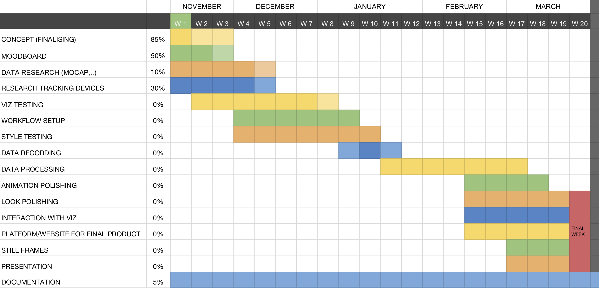

### PROJECT DESCRIPTION
#### ABSTRACT VISUALISATION OF SPORTS
The idea is to generate a visualisation of several sport disciplines by recording specific data. This can be data sources such as motion, which includes position, acceleration and rotation, but also non-visual factors like sound and pulse of the athletes. Research and assessment of prerecorded data would be an alternative to recording the data manually, depending on the realisable amount of work.
The captured data will then be processed by developing fitting algorithms, which enable an artistic visualisation. This will be done with the help of libraries such as P5.js or Processing and therefore either in javascript or java. The generated visuals should not be an obvious simulation of the respective sport, but rather an abstract and creative interpretation. However, each visual representation should have a connection to its data source. This could be a fitting color such as blue for swimming or a recognisable pattern typical for a particular sport. The output will be a combination of data-driven movement as well as artistic choices to achieve a visually appealing animation. 
After completion of the project, the viewer will be able to interact with the visual output. This might include switching and comparing different sports or blending out certain data sources such as audio, which can be used to derive the impact that one data collection has one the whole outcome. Hence, it is important to include a concept of data separation while programming.
Furthermore, still images will be taken from the animation for a prototypical product design. For example, a still image of a climbing visualisation can be used as a print motif for gear, clothing or posters. 

#### MOODS (color, shape, pattern)

---
### WORST CASE
INPUT
- research and assesment of prerecorded data
- two sports
- one data source (e.g. motion tracking with 2-3 features position, acceleration, rotation)
- concept of data source seperation (possibility for interaction in BEST case)

OUTPUT
- no interaction 
- the visualisation is animated, but might jitter slightly
- basic represantation of sport (e.g. fitting color)
- still frames from animation for product design (e.g. gear/shirt with with abstract “climbing” illustration)
- visual understanding of input features (no beautification)

### BEST CASE
INPUT
- recording the data input myself 
- various data sources (e.g. motion tracking, sound, pulse)
- recording at least two sports (e.g. climbing, skating, dancing, etc.)

OUTPUT
- viewer can interact with visualisation (e.g. blending in/out data sources, switch/compare between sports)
- the abstract visualisation is a smooth animation
- more complex representation of sport (e.g. recognisable pattern typical for a particular sport)
- beautification of input features
---
### TIMING

#### NOVEMBER
- concept finalisation
- moodboard
- research for prerecorded mocap data, sound data, pulse,..
- test out visualisation in p5.js
- search for tracking devices

#### DECEMBER
- create workflow
- test out visualisation in p5.js
- style testing
- search for tracking devices

#### JANUARY 
- decide on visual style
- recording the data input myself 

#### FEBRUARY
- platform/website for final product
- polishing animation

#### MARCH
- interaction with visualisation 
- beautification of input features
- still frames from animation for product design
- preperation for presentation

#### APRIL
Finish 🎊
